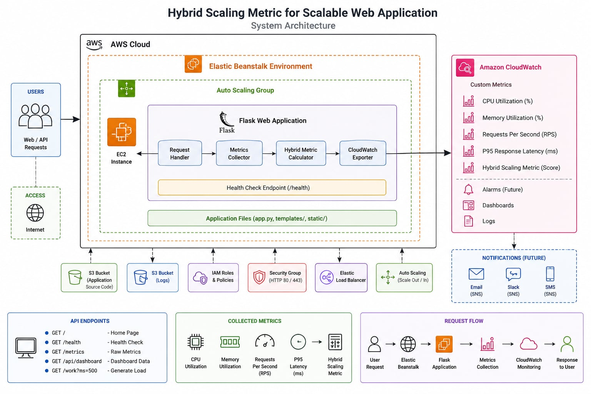

# Project Overview

This project presents the implementation of a cloud-native web application deployed on Amazon Web Services (AWS) that evaluates a Hybrid Scaling Metric for automatic scaling of web applications.

Traditional auto scaling mechanisms generally rely on CPU utilisation alone. However, CPU usage does not always represent the actual workload experienced by modern web applications. This project proposes a hybrid scaling approach by combining multiple performance indicators including:

- CPU Utilisation
- Memory Utilisation
- Requests Per Second (RPS)
- P95 Response Latency

These metrics are continuously collected and combined into a single Hybrid Scaling Score that can later be used to drive more intelligent auto scaling decisions.

The application has been successfully deployed using AWS Elastic Beanstalk, allowing cloud-based testing and future performance evaluation.

# Features

The application currently provides:

- Flask REST API
- Health Check Endpoint
- Live Metrics Endpoint
- Dashboard API
- CPU Monitoring
- Memory Monitoring
- Request Counter
- P95 Latency Calculation
- Hybrid Scaling Metric
- CloudWatch Custom Metrics
- AWS Elastic Beanstalk Deployment

# System Design

The application is designed using a cloud-native architecture and is deployed on AWS Elastic Beanstalk, which simplifies application deployment and automatically manages the underlying AWS infrastructure. When a user sends an HTTP request, it is first received by the Elastic Beanstalk environment and then forwarded to the Flask web application running on an Amazon EC2 instance. The application processes the request and generates the appropriate response while continuously monitoring its runtime performance.

During request processing, the system collects several key performance metrics, including CPU utilisation, memory utilisation, requests per second (RPS), and P95 response latency. These metrics are used to calculate a Hybrid Scaling Metric, which provides a more comprehensive measure of application workload than relying on CPU utilisation alone. This approach is intended to better represent real application performance under different traffic conditions.

The collected metrics are published to Amazon CloudWatch, where they can be monitored and analysed in real time. CloudWatch provides visibility into the application’s performance and serves as the foundation for implementing future auto-scaling policies based on the Hybrid Scaling Metric. By separating the application logic from infrastructure management, the system remains scalable, maintainable, and easy to deploy, allowing developers to focus on application development while AWS manages the operational aspects of the environment.

# Architecture 

# AWS Deployment

The application is deployed on AWS Elastic Beanstalk, which provides a managed platform for hosting and scaling web applications without requiring manual infrastructure configuration. The deployment process begins by packaging the Flask application and uploading it to an Elastic Beanstalk environment. Elastic Beanstalk automatically provisions the required AWS resources, including an Amazon EC2 instance, Auto Scaling Group, Security Groups, IAM roles, and application health monitoring, allowing the application to run in a secure and scalable environment.

Once deployed, incoming user requests are routed to the Flask application running on the EC2 instance, where the application processes requests, collects runtime performance metrics, and calculates the Hybrid Scaling Metric. These custom metrics are then published to Amazon CloudWatch, enabling real-time monitoring and providing the foundation for future intelligent auto-scaling policies. By automating infrastructure provisioning, deployment, monitoring, and health management, Elastic Beanstalk allows developers to focus on application development while AWS manages the operational aspects of the cloud environment.

