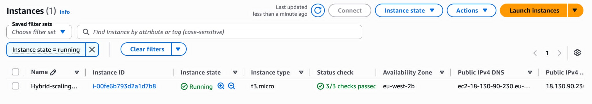
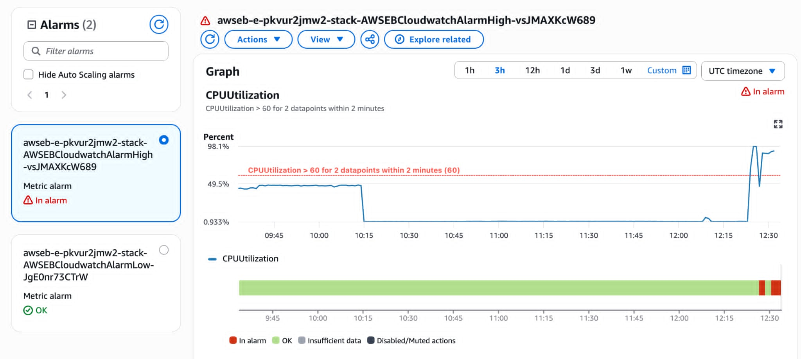
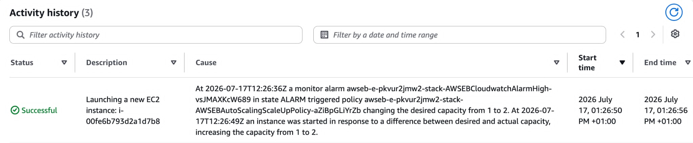
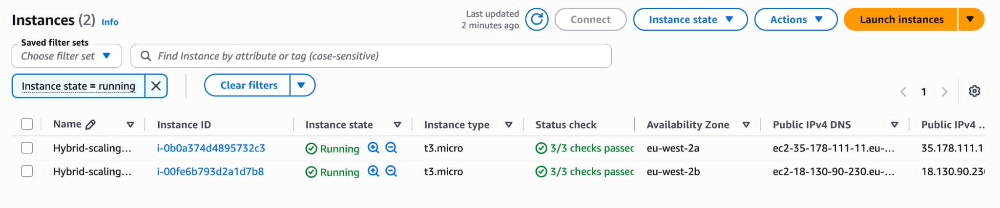
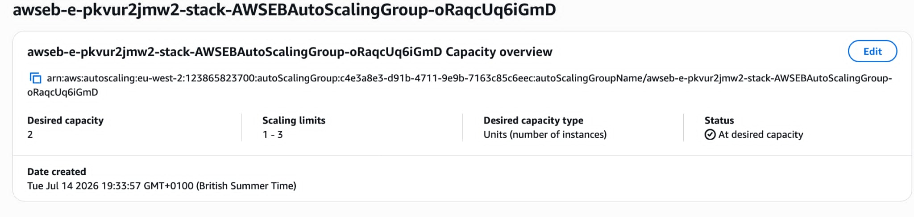
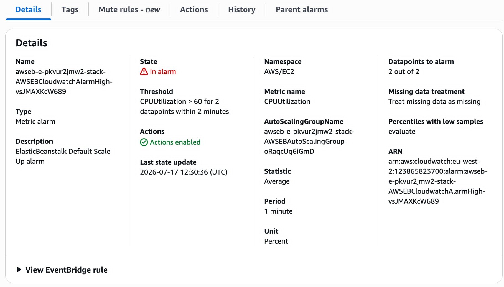
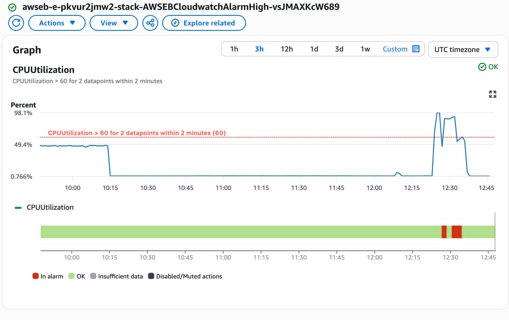
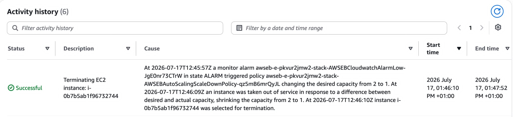
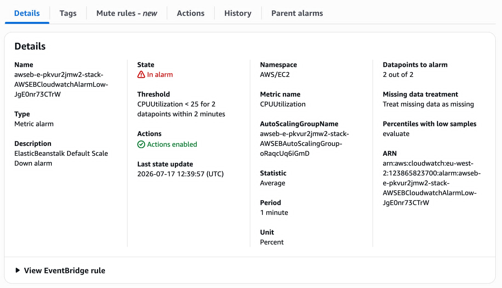

# Project Overview

This project presents the implementation of a cloud-native web application deployed on Amazon Web Services (AWS) that evaluates a Hybrid Scaling Metric for automatic scaling of web applications.

Traditional auto scaling mechanisms generally rely on CPU utilisation alone. However, CPU usage does not always represent the actual workload experienced by modern web applications. This project proposes a hybrid scaling approach by combining multiple performance indicators including:

- CPU Utilisation
- Memory Utilisation
- Requests Per Second (RPS)
- P95 Response Latency

These metrics are continuously collected and combined into a single Hybrid Scaling Score that can later be used to drive more intelligent auto scaling decisions.

The application has been successfully deployed using AWS Elastic Beanstalk, allowing cloud-based testing and future performance evaluation.

# Features

The application currently provides:

- Flask REST API
- Health Check Endpoint
- Live Metrics Endpoint
- Dashboard API
- CPU Monitoring
- Memory Monitoring
- Request Counter
- P95 Latency Calculation
- Hybrid Scaling Metric
- CloudWatch Custom Metrics
- AWS Elastic Beanstalk Deployment

# System Design

The application is designed using a cloud-native architecture and is deployed on AWS Elastic Beanstalk, which simplifies application deployment and automatically manages the underlying AWS infrastructure. When a user sends an HTTP request, it is first received by the Elastic Beanstalk environment and then forwarded to the Flask web application running on an Amazon EC2 instance. The application processes the request and generates the appropriate response while continuously monitoring its runtime performance.

During request processing, the system collects several key performance metrics, including CPU utilisation, memory utilisation, requests per second (RPS), and P95 response latency. These metrics are used to calculate a Hybrid Scaling Metric, which provides a more comprehensive measure of application workload than relying on CPU utilisation alone. This approach is intended to better represent real application performance under different traffic conditions.

The collected metrics are published to Amazon CloudWatch, where they can be monitored and analysed in real time. CloudWatch provides visibility into the application’s performance and serves as the foundation for implementing future auto-scaling policies based on the Hybrid Scaling Metric. By separating the application logic from infrastructure management, the system remains scalable, maintainable, and easy to deploy, allowing developers to focus on application development while AWS manages the operational aspects of the environment.

# Architecture 

# AWS Deployment

The application is deployed on AWS Elastic Beanstalk, which provides a managed platform for hosting and scaling web applications without requiring manual infrastructure configuration. The deployment process begins by packaging the Flask application and uploading it to an Elastic Beanstalk environment. Elastic Beanstalk automatically provisions the required AWS resources, including an Amazon EC2 instance, Auto Scaling Group, Security Groups, IAM roles, and application health monitoring, allowing the application to run in a secure and scalable environment.

Once deployed, incoming user requests are routed to the Flask application running on the EC2 instance, where the application processes requests, collects runtime performance metrics, and calculates the Hybrid Scaling Metric. These custom metrics are then published to Amazon CloudWatch, enabling real-time monitoring and providing the foundation for future intelligent auto-scaling policies. By automating infrastructure provisioning, deployment, monitoring, and health management, Elastic Beanstalk allows developers to focus on application development while AWS manages the operational aspects of the cloud environment.

# CPU Utilization Auto Scaling Experiment

# Objective

The objective of this experiment was to evaluate the default CPU-based auto scaling mechanism provided by AWS Elastic Beanstalk. The experiment aimed to determine whether an EC2 instance would automatically scale out when CPU utilization exceeded the configured threshold and scale back in once the workload returned to normal.

# Auto Scaling Configuration

The Elastic Beanstalk environment was configured with an Auto Scaling Group using CPU Utilization as the scaling metric. The environment initially launched with a single EC2 instance, while the minimum capacity was set to one instance and the maximum capacity was limited to two instances. A scale-out policy was configured to add one additional instance whenever the average CPU utilization exceeded 60%, while a scale-in policy removed the additional instance once CPU utilization remained below the configured threshold after the cooldown period. This configuration allowed the application to automatically adjust its compute resources according to workload demand while preventing unnecessary scaling actions caused by temporary CPU spikes.

Scale-UP Policy             Scale-DOWN Policy
Metric:                     Metric
CPUUtilization              CPUUtilization       

Condition:                  Condition:
CPU > 60%                   CPU < 25%

Evaluation:                 Evaluation:
2 consecutive periods       2 consecutive periods
(2 × 60 seconds)

Action:                     Action:
+1 EC2 instance             -1 EC2 instance

Cooldown:                   Cooldown:
300 seconds                 300 seconds

# Experimental Results

The experiment demonstrated that the application initially operated on a single EC2 instance while CPU utilization remained below the configured threshold. As the generated workload increased, CPU utilization gradually rose above 60%, triggering the configured Auto Scaling policy. Elastic Beanstalk automatically launched a second EC2 instance, and the Auto Scaling Group updated the desired capacity from one to two instances without requiring manual intervention. This confirmed that the CPU-based scaling policy was functioning as expected.

After the workload generation was stopped, CPU utilization decreased significantly. Following the configured cooldown period, the Auto Scaling Group automatically terminated the additional EC2 instance and returned the environment to its original single-instance state. This verified that both scale-out and scale-in operations were successfully performed based on CPU utilization.

### CPU Utilization Before Load

### CPU Utilization Exceeding 60%

### Auto Scaling Triggered

### Second EC2 Instance Running

### Desired Capacity Increased to 2

### Scale-Up After Workload Completed

### CPU Utilization Below 25%

### Auto Scaling Triggered

### Scale-Down

Observations

The experiment produced several important observations:

- CPU utilization increased steadily as concurrent requests were generated.
- The configured threshold of 60% CPU utilization successfully triggered the scale-out event.
- Elastic Beanstalk automatically provisioned a second EC2 instance.
- The Auto Scaling Group updated the desired capacity from 1 to 2 instances.
- CloudWatch metrics clearly reflected the increase in CPU utilization before the scaling event.
- After the workload stopped, CPU utilization returned to normal.
- The Auto Scaling Group automatically removed the additional EC2 instance after the cooldown period.
- The experiment confirmed the successful operation of AWS’s default CPU-based Auto Scaling mechanism.